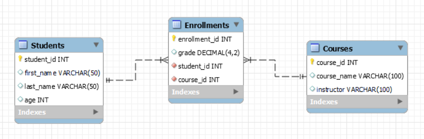

# SQL with MySQL (Part2)

By the end of this lesson, the student will understand how to combine data from multiple tables using different types of `JOIN`s, summarize data using aggregation functions, group and filter grouped results with `GROUP BY` and `HAVING`, and modify or remove data with `UPDATE` and `DELETE` statements. Additionally, they will gain a clear understanding of what a relational schema is and how it helps structure data in a database.

## Environment Setup
### Prerequisites
- [Docker (Desktop for Windows)](https://www.docker.com/products/docker-desktop/)
- [MySQL Workbench](https://www.mysql.com/products/workbench/)

### Installation
In a Terminal / CMD execute the following command while Docker is running in the background. This will:
- Download the `MySQL:8.0` DockerHub [image](https://hub.docker.com/_/mysql).
- Create a `MySQL:8.0` container named as `my-own-mysql` and expose it in the following DNS/port: `localhost:3306`.
  - The container will have a MySQL DBMS with the follogin root credentials: {user: "root", password: "bakobako"}.

```docker
docker run --name my-own-mysql -e MYSQL_ROOT_PASSWORD=bakobako -d -p 3306:3306 mysql:8.0
```

### MySQL Workbench Setup
Open up MySQL Workbench and connect to your local MySQL DBMS with your credentials specified above.

### Create Schema in MySQL
On a query file inside the MySQL Workbench and execute the content in [this](./example-schema.sql) SQL file.

### Uninstallation
To uninstall your database you can run the following command in a Terminal/CMD
```docker
docker rm -f my-own-mysql
```

## Table of Contents
- **[Relational Schema](#relational-schema)**.
- **[Introduction to `JOIN`](#introduction-to-join)**.
- **[Aggregation Functions](#aggregation-functions)**.
- **[`GROUP BY` and `HAVING`](#group-by-and-having)**.
- **[SQL Subqueries](#sql-subqueries)**
- **[`UPDATE` and `DELETE`](#update-and-delete)**.
- **[Practice Time 1](#practice-time-1)**.
- **[Practice Time 2](#practice-time-2)**.
- **[Next Steps](#next-steps)**.

## Relational Schema

In real-world databases, data is often split into **multiple tables** to keep things organized and avoid repetition. These tables are connected through relationships — just like puzzle pieces that fit together to make a bigger picture. This structure is called a **Relational Schema**.

What Is a Relational Schema?
- What tables exist in a database
- What each table contains (columns)
- How tables are connected to each other
It’s like a blueprint that helps you understand **how the data fits together**.

### Keys: The Connectors
To connect tables, we use two types of keys:
| Type of Key | Description | Example |
| --- | --- | --- |
| **Primary Key** | A unique ID for each row in a table. | `student_id` in `Students` |
| **Foreign Key** | A reference to a primary key in another table. | `student_id` in `Enrollments` (points to `Students`) |

### Example Schema
In our school database, we have three tables:

#### 1. `Students`

Stores information about students.
- **Primary key**: `student_id`

#### 2. `Courses`

Stores information about courses.
- **Primary key**: `course_id`

#### 3. `Enrollments`

Connects students to courses and stores their grades.
- Has two foreign keys:
  - `student_id` → links to `Students`.
  - `course_id` → links to `Courses`.

How They're Connected


This means:
- One student can enroll in many courses.
- One course can have many students.
- The `Enrollments` table bridges the two.

## Introduction to `JOIN`

Follow the **[Environment Setup](#environment-setup)** to have the recuired information reafy to follow this Section.

Sometimes, the data you need is **spread across multiple tables**. That’s where `JOIN` comes in. A `JOIN` lets you **combine rows from two or more tables** based on a related column — usually a key. Think of it like this: **"Match rows from Table A with rows from Table B where a specific column is the same."**

Basic Format:
```sql
SELECT table1.column, table2.column
FROM table1
JOIN table2 ON table1.related_column = table2.related_column;
```
There are different types of joins, but let’s start with the most common one: `INNER JOIN`.

Let’s Try Some `JOIN` Queries Using Our School Example! Let’s Try Some JOIN Queries Using Our School Example!
1. List Student Names with the Courses They're Enrolled In:
```sql
SELECT Students.first_name, Students.last_name, Courses.course_name
FROM Students
JOIN Enrollments ON Students.student_id = Enrollments.student_id
JOIN Courses ON Enrollments.course_id = Courses.course_id;
-- This shows each student along with the name of the course they’re enrolled in.
```
The above is the same as the following:
```sql
SELECT Students.first_name, Students.last_name, Courses.course_name
FROM Students, Enrollments, Courses
WHERE Students.student_id = Enrollments.student_id
  AND Enrollments.course_id = Courses.course_id;
```
You can absolutely write a `JOIN`-like query using only the `WHERE` clause and listing multiple tables in the `FROM` part. This was actually the **classic way to write joins** before `JOIN ... ON` became the standard.

Note:
- Using `JOIN ... ON` is preferred in modern SQL because it’s clearer, especially with more complex queries or different join types (`LEFT JOIN`, etc.).
- But for **simple** `INNER JOIN`s, using `WHERE` works just fine and is helpful to understand how SQL matches data under the hood.

2. Show Students and Their Grades:
```sql
SELECT Students.first_name, Students.last_name, Courses.course_name, Enrollments.grade
FROM Students
JOIN Enrollments ON Students.student_id = Enrollments.student_id
JOIN Courses ON Enrollments.course_id = Courses.course_id;
-- This gives you a more complete view — who’s studying what, and how they’re doing.
```

3. Filter with a JOIN:
```sql
SELECT Students.first_name, Courses.course_name
FROM Students
JOIN Enrollments ON Students.student_id = Enrollments.student_id
JOIN Courses ON Enrollments.course_id = Courses.course_id
WHERE Courses.course_name = 'Mathematics';
-- Only shows students who are enrolled in Mathematics.
```

### Types of JOIN

|Type | Description |
| --- | --- |
| `INNER JOIN` | Only returns rows where there’s a match in both tables. |
| `LEFT JOIN` | Returns all rows from the left table, and matched rows from the right (if any). |
| `RIGHT JOIN` | Returns all rows from the right table, and matched rows from the left (if any). |
| `FULL JOIN` | (Not in MySQL by default) Returns all rows when there’s a match in one of the tables. |

> **Question**: Can you write a query to list each course even if no students are enrolled in it?<br>
> (Hint: You'll need a `LEFT JOIN`)

**Answer**: Yes, by doing the following:
```sql
SELECT Courses.course_name, Enrollments.enrollment_id
FROM Courses
LEFT JOIN Enrollments ON Courses.course_id = Enrollments.course_id;
```
What This Does:
- The `LEFT JOIN` keeps **all courses**, even if there’s **no matching enrollment**.
- If a course has no students enrolled, the `enrollment_id` (and any other columns from `Enrollments`) will be `NULL`.

Here is a query to show only **courses with no enrollments**:
```sql
SELECT course_name
FROM Courses
LEFT JOIN Enrollments ON Courses.course_id = Enrollments.course_id
WHERE Enrollments.enrollment_id IS NULL;
-- This shows only the courses that no one has enrolled in yet.
```

## Aggregation Functions

So far, you've learned how to select and filter rows. But what if you want to summarize your data?

Aggregation functions let you do just that! They help you **calculate values** across multiple rows — like totals, averages, counts, and more.

Common Aggregation Functions

| Function | What It Does | Example |
| --- | --- | --- |
| `COUNT()` | Counts how many rows | `COUNT(*)` |
| `SUM()` | Adds up numeric values | `SUM(grade)` |
| `AVG()` | Calculates the average | `AVG(grade)` |
| `MIN()` | Finds the smallest value | `MIN(grade)` |
| `MAX()` | Finds the largest value | `MAX(grade)` |

### Examples Using the `Enrollments` table

1. Count how many enrollments exist:
```sql
SELECT COUNT(*) FROM Enrollments;
-- This tells us how many total enrollment records are in the table.
```

2. Find the average grade across all students:
```sql
SELECT AVG(grade) FROM Enrollments;
-- This calculates the overall average grade.
```

3. Find the highest grade in the system:
```sql
SELECT MAX(grade) FROM Enrollments;
-- Shows the top score among all enrollments.
```

4. See the total number of students enrolled in Course 101:
```sql
SELECT COUNT(*) FROM Enrollments
WHERE course_id = 101;
-- This counts how many students are enrolled in Mathematics (Course 101).
```

> Aggregation functions work on groups of rows, but they return a single result — unless you combine them with GROUP BY, which we’ll look at next!

## `GROUP BY` and `HAVING`
Aggregation functions like `COUNT()` or `AVG()` are great — but what if you want to group your results by a specific category? That’s where `GROUP BY` comes in. `GROUP BY` lets you group rows that share a value in a specific column, and then apply aggregation functions **to each group**. Think of it like this: **"Group the data by this column — and summarize each group."**

Basic Format:
```sql
SELECT column, AGGREGATE_FUNCTION(column)
FROM table
GROUP BY column;
```

### Examples
1. How many students are enrolled in each course?
```sql
SELECT course_id, COUNT(*) AS total_enrollments
FROM Enrollments
GROUP BY course_id;
-- This shows each course along with how many students are taking it.
```

2. What is the average grade for each course?
```sql
SELECT course_id, AVG(grade) AS average_grade
FROM Enrollments
GROUP BY course_id;
-- This gives you the average grade per course.
```

#### Enter: `HAVING`

You’ve used `WHERE` to filter **rows**, but `WHERE` **works before grouping**. If you want to filter **after grouping**, you need `HAVING`.
> Use `HAVING` to filter groups.

3. Find courses with more than 3 enrollments:
```sql
SELECT course_id, COUNT(*) AS total
FROM Enrollments
GROUP BY course_id
HAVING COUNT(*) > 3;
-- This only shows courses where more than 3 students are enrolled.
```

### `WHERE` vs `HAVING`

| Clause | Filters... | Example |
| --- | --- | --- |
| `WHERE` | rows (**before** grouping) | `WHERE course_id = 101` |
| `HAVING` | groups (**after** grouping) | `HAVING COUNT(*) > 5` |

## SQL Subqueries

A subquery is a query **inside another query**. Think of it like asking a question **inside** a bigger question. You can use subqueries when you need the result of one query **to help** with another.

Basic Format:
```sql
SELECT column
FROM table
WHERE something IN (SELECT ...);
```
The inner query runs **first**, and its result is passed to the outer query.

### Examples

1. Students Enrolled in Course 101:
```sql
SELECT first_name, last_name
FROM Students
WHERE student_id IN (
    SELECT student_id
    FROM Enrollments
    WHERE course_id = 101
);
-- This shows the names of all students enrolled in Mathematics.
```
Here’s what’s happening:
- Inner query: Finds all `student_ids` in course 101.
- Outer query: Finds names of those students.

2. Courses with Average Grade Above 85:
```sql
SELECT course_name
FROM Courses
WHERE course_id IN (
    SELECT course_id
    FROM Enrollments
    GROUP BY course_id
    HAVING AVG(grade) > 85
);
-- This shows the names of high-performing courses.
```

3. Students With the Highest Grade in the System:
```sql
SELECT first_name, last_name
FROM Students
WHERE student_id IN (
    SELECT student_id
    FROM Enrollments
    WHERE grade = (SELECT MAX(grade) FROM Enrollments)
);
-- Finds student(s) who achieved the top grade.
```
> Tip: You can use subqueries in `SELECT`, `FROM`, or `WHERE` clauses — but `WHERE` is the most common when starting out.

## `UPDATE` and `DELETE`

So far, you’ve learned how to view and analyze data. Now it’s time to learn how to change it. In SQL, we use `UPDATE` to change existing data and `DELETE` to remove it. 
> Be careful with these — they modify your database!

### `UPDATE` — Change Existing Data

The `UPDATE` statement lets you modify one or more columns in one or more rows.
```sql
UPDATE table_name
SET column1 = value1, column2 = value2
WHERE condition;
```
> Always use a `WHERE` clause to avoid updating every row by mistake!

#### `UPDATE` Examples
1. Update a student’s city:
```sql
UPDATE Students
SET age = 31
WHERE student_id = 3;
-- Changes the age of student with ID 3 to 31 years old.
```

2. Increase a grade by 5 points:
```sql
UPDATE Enrollments
SET grade = grade + 5
WHERE enrollment_id = 2;
-- Gives a grade boost to one enrollment.
```

### `DELETE` — Remove Data

The `DELETE` statement removes rows from a table.

Basic Format:
```sql
DELETE FROM table_name
WHERE condition;
```
> ❗ Always double-check your `WHERE` clause before running a delete.

#### `DELETE` Examples

1. Remove a student from the database:
```sql
DELETE FROM Enrollments
WHERE student_id = 5 AND course_id = 104;
-- Remove the student with ID 5 from the course with ID 104.
```

2. Delete all enrollments with a grade below 50:
```sql
DELETE FROM Enrollments
WHERE grade < 50;
-- Removes all failing grades.
```
> In case you get the error: `You are using safe update mode and you tried to update a table without a WHERE that uses a KEY column. To disable safe mode, toggle the option in Preferences -> SQL Editor and reconnect.` Do the followiing: 1. Go to `Edit` --> `Preferences`, 2. Click `SQL Editor` tab and uncheck `Safe Updates` check box, 3. Go to `Query` --> `Reconnect to Server` --> Use your database again and try again.

### What If You Forget WHERE?
Without a `WHERE` clause:
```sql
DELETE FROM Students;
-- This deletes **every student**. Be careful!
```
> Tip: When testing, use a SELECT with the same WHERE first, to see what you'll be changing or deleting.

## Practice Time 1
### Step 1: Installation
You’ll be using the `SchoolDB` database and its `Students`, `Courses`, and `Enrollments` tables from **[this](./example-schema.sql)** file.

### Step 2: `JOIN` Practice
1. Show each student's full name and the names of the courses they are enrolled in.
2. List all students and their grades in "Mathematics".
3. Show the names of all instructors and how many students are enrolled in their courses.
4. Display all students who **are not enrolled in any course**.

### Step 3: Aggregation + `GROUP BY` + `HAVING`
5. Show the **average grade** for each course.
6. Show the courses with an average grade **greater than 85**.
7. For each student, show the total number of courses they are enrolled in.
8. List the students who are enrolled in **more than 2 courses**.

### Step 4: `UPDATE` & `DELETE`
9. Update **Hannah Martinez**'s grade in "Biology" to 95.00.
10. Increase all grades in "Physics" by 5 points (maximum of 100).
11. Delete all enrollment records where the grade is below 70.
12. Delete all enrollments for **students older than 24**.

### Step 5: Subqueries
13. Show the students who have the **highest grade** across all courses.
14. List the courses that **no students are enrolled** in.
15. Show the student(s) who have the **highest number of enrollments**.
16. Show all instructors who teach a course where the **average grade** is **below 80**.
17. Show students who **are enrolled** in **both "Mathematics" and "Biology"**.

## Practice Time 2


## Next Steps
- Intro to Python + MySQL.
- Executing `INSERT`, `UPDATE`, `DELETE` from Python.
- Creating Reusable Functions.
- Mini Project: Console App.
- **Challenge**!