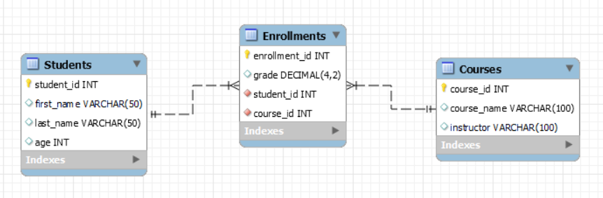

# MySQL with Python

By the end of this lesson, the student will understand how to connect a Python application to a MySQL database and interact with it using Python code. They will learn how to execute SQL commands like `CREATE`, `SELECT`, `INSERT`, `UPDATE`, and `DELETE` directly from Python, and how to build reusable functions for database operations. The lesson culminates in designing a simple console-based app that puts all of these concepts into practice. Students will also face a final challenge to apply what they’ve learned in a hands-on, creative task.

## Environment Setup
### Prerequisites
- [Docker (Desktop for Windows)](https://www.docker.com/products/docker-desktop/)
- [MySQL Workbench](https://www.mysql.com/products/workbench/)
- [Python3 (Version 3.13+)](https://www.python.org/downloads/)
- [Visual Studio Code](https://code.visualstudio.com/)

### Installation
In a Terminal / CMD execute the following command while Docker is running in the background. This will:
- Download the `MySQL:8.0` DockerHub [image](https://hub.docker.com/_/mysql).
- Create a `MySQL:8.0` container named as `my-own-mysql` and expose it in the following DNS/port: `localhost:3306`.
  - The container will have a MySQL DBMS with the follogin root credentials: {user: "root", password: "bakobako"}.

```docker
docker run --name my-own-mysql -e MYSQL_ROOT_PASSWORD=bakobako -d -p 3306:3306 mysql:8.0
```

### MySQL Workbench Setup
Open up MySQL Workbench and connect to your local MySQL DBMS with your credentials specified above.

### Python's Virtual Environment Installation
In a terminal/CMD execute the following command to install Python's Virtual Environment in your machine:
```bash
pip install virtualenv
```

### Uninstallation
To uninstall your database you can run the following command in a Terminal/CMD:
```docker
docker rm -f my-own-mysql
```

You can also uninstall Python's Virtual Environment with the following command ~ but it is not advised in case that you will be using Python for development:
```bash
pip uninstall virtualenv
```

## Table of Contents
- **[Intro to Python](#intro-to-python)**.
- **[Python and MySQL](#python-and-mysql)**.
- **[Executing SQL Queries from Python](#executing-sql-queries-from-python)**.
- **[Creating Reusable Functions](#creating-reusable-functions)**.
- **[Creating a Console App](#creating-a-console-app)**.
- **[Challenge](#challenge)!**
- **[Next Steps](#next-steps)**.

## Intro to Python

### Executing a Python Script
To explain how to run a Python Script, the following code will be used as an example. The code is stored in a file named `my_file.py`:
```python
# Flask example
from flask import Flask

x = 5 + 5
print(x)
```
The above code installs the `flask` library to be executed. If we try to execute the file with the `python my_file.py` command we will get the following error:
```
Traceback (most recent call last):
  File "C:\Users\pkara\OneDrive\Υπολογιστής\test\my_file.py", line 2, in <module>
    from flask import Flask
ModuleNotFoundError: No module named 'flask'
```
The code does not run because we do not have the `flask` library installed. We will install it using a `Python Virtual Environment`. We execute the following commands in a CMD/Terminal:
```shell
# Install Python's Virtual Environment
pip install virtualenv

# Build a Python Virtual Environment
python -m venv my_venv

# Activate the new Python Virtual Environment
# (For Windows)
.\my_venv\Scripts\activate
# (For Linux)
source my_venv/bin/activate

# Install the flask library
pip install flask
```

Now we have installed the necessary `flask` libraries and `flask` itself. We can see the libraries by typing `pip freeze` and we can save them all in a file by typing `pip freeze > requirements.txt`.

Now we can run our script by typing the following and expect the number `10` to appear:
```shell
python my_file.py
```

To exit the Python Virtual Environment (i.e. disable it), we can type the following in the CMD/Terminal:
```shell
# Deactivating Python's Virtual Environment
deactivate

# To re-activate it ~ If needed (For Windows)
.\my_venv\Scripts\activate
```

### Variables and Printing
In the following Examples you can see scripts and their corresponding results. Try to execute the examples on your machine as well, or use a site such as [Programiz](https://www.programiz.com/python-programming/online-compiler/) to execute them online.

👉 Variables are like labeled boxes where you can store values. The `print()` function lets you see the result of your code.
```python
# This is a single line comment in Python

"""
This is how you
write a multiple line comment in Python
"""
x = 5 + 5  # Adding two numbers and storing the result in variable x
print(x)   # Printing the value of x

y = 6 - 3  # Subtracting two numbers and storing the result in variable y
print(y)   # Printing the value of y
```
Result:
```
10
3
```

### Functions
By using `def` we can create Python functions by specifying their input and output. A function can exist without any input or output.

👉 Functions are blocks of reusable code. You can use them to organize your code better and avoid repetition.
```python
def add(x, y):      # This function adds two numbers
    return x + y

def sub(x, y):      # This function subtracts two numbers
    return x - y

x = add(5, 5)       # Call the add function and store the result
print(x)

y = sub(6, 3)       # Call the sub function and store the result
print(y)
```
Result:
```
10
3
```

### Classes and Objects
By using the keyword `class`, we can create a Python class. A **class** is like a blueprint for creating objects. It defines what properties (data) and behaviors (functions) the objects will have. An **object** is an instance of a class — it’s a real thing based on that blueprint.

In the example below, we define a class called `Point` that represents a point in 2D space with coordinates `x` and `y`.

The `__init__` function is a special function called a **constructor**. It is automatically called when we create a new object from the class. The constructor lets us set up the initial values for the object’s data.

👉 We also define methods (functions inside a class) to set and get the values of `x` and `y`. This is an example of **encapsulation**, which means hiding the internal data of the object and interacting with it through functions.
```python
class Point:
    def __init__(self, x=0, y=0):  # Constructor
        self.x = x
        self.y = y

    # Encapsulation: Setters
    def set_X(self, x):
        self.x = x

    def set_Y(self, y):
        self.y = y

    # Encapsulation: Getters
    def get_X(self):
        return self.x

    def get_Y(self):
        return self.y

# Creating an object from the Point class
point = Point(x=1, y=10)

# Accessing values using the getter methods
print(point.get_X())  # Output: 1
print(point.get_Y())  # Output: 10
```
Result:
```
1
10
```
This is how you create and use classes and objects in Python. You can think of it like designing a custom data type — one that you can build, update, and use in your programs.

### Comparison Operators
[Here](https://www.w3schools.com/python/python_operators.asp) you can find all the Python Operators.

👉 Comparison Operators are used to compare values.
```python
a = 10
b = 15

if a > b:
    print(a, "is biggger than ", b) # Using ""
elif b > a:
    print(b, 'is bigger than', a)   # Using ''
else:
    print("They are equal")
```

Results:
```
15 is bigger than 10
```

### Logical Operators
👉 Logical Operators are used to combine conditions or check if one thing is inside another.
```Python
a = "this is a string"
b = "this"

if b not in a:
    print("b is not in a")
else:
    print("b is in a")

a = "this is a string"
b = "hello"

if b not in a:
    print("b is not in a")
else:
    print("b is in a")
```

Result:
```
b is in a
b is not in a
```

### Simple For Loop
👉 Used to repeat a block of code a certain number of times.
```Python
printme10times = "hello world"

for i in range(10):
    print(printme10times)
```

Result:
```
hello world
hello world
hello world
hello world
hello world
hello world
hello world
hello world
hello world
hello world
```

### Simple While Loop
👉 A While loop is running as long as a condition is `True`.
```Python
count = 1  # Initialize a counter variable

# Keep looping until the count reaches 5
while count <= 5:
    print(count)  # Print the current value of count
    count += 1    # Increment the count by 1 in each iteration

print("Loop completed!")  # This line will execute after the loop exits
```

Result:
```
1
2
3
4
5
Loop completed!
```
👉 Below is an example with User Input as well:
```Python
user_input = ''  # Initialize the variable to hold user input

# Keep asking for input until the user enters 'quit'
while user_input != 'quit':
    user_input = input("Enter 'quit' to exit: ")

print("You've exited the loop!")  # This line will execute after the loop exits
```

Result:
```
Enter 'quit' to exit: done
Enter 'quit' to exit: not done
Enter 'quit' to exit: Quit
Enter 'quit' to exit: quit
You've exited the loop!
```

### Item Iteration
👉 You can loop over items in a list:
```Python
# Initialising a List of Items
myList = ["apple", "lemon", "pie", 4]

for item in myList:
    print("this item is a / an:", item)
```

Result:
```
this item is a / an: apple
this item is a / an: lemon
this item is a / an: pie
this item is a / an: 4
```

### List Handling
👉 Lists are like containers that can hold multiple values:
```Python
mylist = [1, 2, 3, 4, 5]

mylist.extend("end")  # "end" is a list of chars
mylist.append(["end"])
for item in mylist:
    print(item)

print(type(mylist[0]))
print(type(mylist[-1]))
```

Result:
```
1
2
3
4
5
e
n
d
['end']
<class 'int'>
<class 'list'>
```
👉 An example of a search and condition check follows:
```Python
mylist = ["apple", "lemon", "pie", "Cinnamon", "cinnamon"]

for item in mylist:
    if "cinnamon" not in item:
        print("Not here")
    else:
        print("Found it!")
```

Result:
```
Not here
Not here
Not here
Not here
Found it!
```
👉 Example to update specific items:
```Python
mylist = [1, 2, 3, 4, 5]

for i, item in enumerate(mylist):
    if item == 1:
        mylist[i] = 100

for i, item in enumerate(mylist):
    print(i, " ", item)
```

Result:
```
0   100
1   2
2   3
3   4
4   5
```

### Initialization and Use of Dictionaries
👉 Dictionaries store data using key-value pairs.
```Python
my_dict = {
    "name": "Student",  # Key : Value
    "course" : "Information Systems",  # Key : Value
    "year": 2020  # Key : Value
}

print(my_dict)

my_dict["course_id"] = "DS-512"
print(my_dict)
```
Result:
```
{'name': 'Student', 'course': 'Information Systems', 'year': 2020}
{'name': 'Student', 'course': 'Information Systems', 'year': 2020, 'course_id': 'DS-512'}
```

👉 Modify existing values:
```Python
my_dict = {
    "name": "Student",
    "course" : "Information Systems",
    "year": 2020
}

print(my_dict)

my_dict["name"] = "Another Student"
print(my_dict)
```
Result:
```
{'name': 'Student', 'course': 'Information Systems', 'year': 2020}
{'name': 'Another Student', 'course': 'Information Systems', 'year': 2020}
```

### Loops and Dictionaries
👉 Loop through a dictionary to access keys and values.
```Python
my_dict = {
    "name": ["S1", "S2"],
    "course" : "Information Systems",
    "year": 2020
}

for key in my_dict:
    print("The key is:", key)
    print("The value is:", my_dict[key], "\n")
```
Result:
```
The key is: name
The value is: ['S1', 'S2'] 

The key is: course
The value is: Information Systems 

The key is: year
The value is: 2020 
```

### Dictionaries and Lists
You can combine lists and dictionaries for more complex data. 

👉 Check if a course exists:
```Python
my_list = [
    {"title": "Information Systems", "id": "DS-512"},
    {"title": "C Programming", "id": "DS-501"},
    {"title": "Operating Systems", "id": "DS-209"}
]

for item in my_list:
    if item["id"] == "DS-512":
        print("There is a course with that ID.")
```

Result:
```
There is a course with that ID.
```
👉 Calculate the average grade:
```Python
my_dict = {"grades" : [5, 6, 4, 7, 19]}

count = 0
i = 0
for key in my_dict:
    for grade in my_dict[key]:
        count += grade
        i += 1
print("The average is equal to:", count / i)
```

Result:
```
The average is equal to: 8.2
```

## Python and MySQL

To connect Python with a MySQL database, we use a library called `mysql-connector-python`. This allows Python to send SQL queries directly to a MySQL database.

### Installing the MySQL Connector

```shell
pip install mysql-connector-python
```

### Connecting to the Database
Here is how you connect to the Docker-hosted MySQL database:
```Python
import mysql.connector

# Establish connection
db = mysql.connector.connect(
    host="localhost",
    user="root",
    password="bakobako"
)

# Create a cursor object
cursor = db.cursor()

print("Connected to MySQL!")
```
This code opens a connection to your MySQL server and allows Python to communicate with it.

## Executing SQL Queries from Python

Once connected, you can use the cursor object to execute SQL statements like `CREATE`, `INSERT`, `SELECT`, etc.

### Creating a Database and Table
```Python
cursor.execute("CREATE DATABASE IF NOT EXISTS school_db")
cursor.execute("USE school_db")
cursor.execute("""
CREATE TABLE IF NOT EXISTS students (
    id INT AUTO_INCREMENT PRIMARY KEY,
    name VARCHAR(255),
    age INT
)
""")
```

### Inserting Data
```Python
cursor.execute("INSERT INTO students (name, age) VALUES (%s, %s)", ("Alice", 23))
db.commit()  # Always commit after inserting/updating/deleting
```

### Reading Data
```Python
cursor.execute("SELECT * FROM students")
result = cursor.fetchall()

for row in result:
    print(row)
```

### Updating Data
```Python
cursor.execute("UPDATE students SET age = 24 WHERE name = 'Alice'")
db.commit()
```

### Deleting Data
```Python
cursor.execute("DELETE FROM students WHERE name = 'Alice'")
db.commit()
```

## Creating Reusable Functions

Instead of writing SQL code every time, you can wrap your operations in Python functions:
```Python
def add_student(name, age):
    cursor.execute("INSERT INTO students (name, age) VALUES (%s, %s)", (name, age))
    db.commit()

def list_students():
    cursor.execute("SELECT * FROM students")
    return cursor.fetchall()

def delete_student(name):
    cursor.execute("DELETE FROM students WHERE name = %s", (name,))
    db.commit()
```
You can now call these functions as needed:
```Python
add_student("Bob", 25)
students = list_students()
for s in students:
    print(s)
```

## Creating a Console App
Let’s build a mini app to interact with the database using the command line.

Create a Python file with the contents [this](./student_manager.py) file, activate a Python Virtual Environment and execute it to handle a Database in the MySQL DBMS.

Here are the actions you will need to do, to achieve the above:
- Copy the contents of the file in a new file and name it as `student_manager.py`
- Create a Python Virtual Environment:
```shell
python -m venv venv
``` 
- Activate the envionment:
```shell
.\my_venv\Scripts\activate
```
- Install the MySQL Python Library:
```shell
pip install mysql-connector-python
```
- Execute the Python file:
```shell
python student_manager.py
```

## Challenge
Create a console-based Course Manager application where users can:
- Add new courses (title, instructor).
- List all courses.
- Search courses by title.
- Delete courses.
- Link students to courses using a many-to-many relationship (Enrollments).
- 📌 Bonus: Add a feature to update course titles and display all students enrolled in a course.

The Database must be created inside your Python Application and the schema must be the following:


## Next Steps
- What is NoSQL?
- Types of NoSQL Databases
- Intro to MongoDB (Document-Based NoSQL)
- Basic CRUD Operations in MongoDB
- Data Modeling in NoSQL
- Python and MongoDB
- Mini Project: Build a MongoDB-backed Console App
- **Challenge!**
